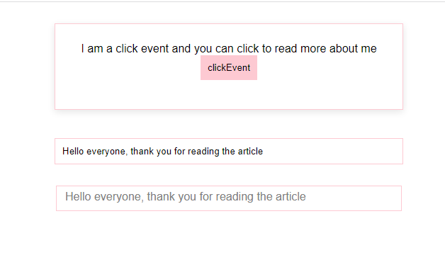

JAVASCRIPT EVENT AND IT EFFECT ON THE BROWSER UI

This is a project to help those who might want to learn how an event in javascript works and because it's a javascript lesson, I made use of pour vanilla Javascript. The challenge some of us who are beginners have when learning is how to simplify learning to our understanding, that's if you can explain to yourself you should to other persons.

The final result of the project could be tested by clicking the button to see the effect on the screen of the browser and for the keyup event, you can type on the input box provided to see the event fires in the fieldset provided as well.

 

Thanks
